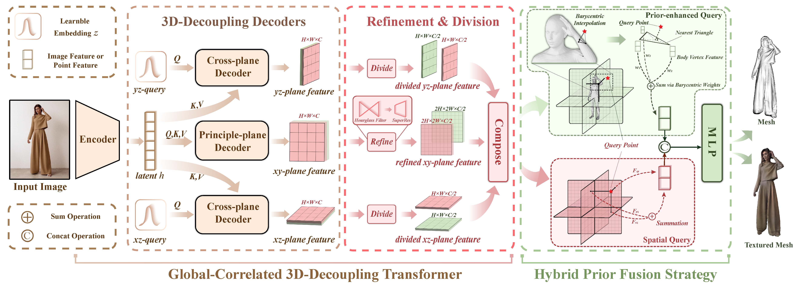

# Official Implementation for GTA (NeurIPS 2023)
> **Global-correlated 3D-decoupling Transformer for Clothed Avatar Reconstruction (NeurIPS 2023)** [[Paper](https://arxiv.org/abs/2309.13524)] [[Website](https://river-zhang.github.io/GTA-projectpage/)]

# News 
- **[2023/12/29]** We are thrilled to announce the release of our latest model, [SIFU](https://github.com/River-Zhang/SIFU), offering enhanced geometry and texture reconstruction capabilities!
- **[2023/11/30]** We release code including inference and testing.
- **[2023/9/26]** We release the arXiv version ([Paper in arXiv](https://arxiv.org/abs/2309.13524)).

# TODO

- [ ] Hugging Face
- [√] Release code
- [√] Release paper


# Introduction
Reconstructing 3D clothed human avatars from single images is a challenging task, especially when encountering complex poses and loose clothing. Current methods exhibit limitations in performance, largely attributable to their dependence on insufficient 2D image features and inconsistent query methods. Owing to this, we present the Global-correlated 3D-decoupling Transformer for clothed Avatar reconstruction (GTA), a novel transformer-based architecture that reconstructs clothed human avatars from monocular images. Our approach leverages transformer architectures by utilizing a Vision Transformer model as an encoder for capturing global-correlated image features. Subsequently, our innovative 3D-decoupling decoder employs cross-attention to decouple tri-plane features, using learnable embeddings as queries for cross-plane generation. To effectively enhance feature fusion with the tri-plane 3D feature and human body prior, we propose a hybrid prior fusion strategy combining spatial and prior-enhanced queries, leveraging the benefits of spatial localization and human body prior knowledge. Comprehensive experiments on CAPE and THuman2.0 datasets illustrate that our method outperforms state-of-the-art approaches in both geometry and texture reconstruction, exhibiting high robustness to challenging poses and loose clothing, and producing higher-resolution textures.




# Installation

- Ubuntu 20 / 18
- GCC = 7.5.0
- **CUDA=11.3, GPU Memory > 20GB**
- Python = 3.8
- PyTorch = 1.13.0 (official [Get Started](https://pytorch.org/get-started/locally/))
- PyTorch3D (official [INSTALL.md](https://github.com/facebookresearch/pytorch3d/blob/main/INSTALL.md), recommend [install-from-local-clone](https://github.com/facebookresearch/pytorch3d/blob/main/INSTALL.md#2-install-from-a-local-clone))

```bash

git clone https://github.com/River-Zhang/GTA.git
sudo apt-get install libeigen3-dev ffmpeg
cd GTA
conda env create -f environment.yaml
conda activate gta
pip install -r requirements.txt

```
Please download the [checkpoint](https://drive.google.com/file/d/1zgpW8A0-sc24o-e24RphO-h9qxo-DRth/view?usp=sharing) and place them in ./data/ckpt

Please follow [ICON](https://github.com/YuliangXiu/ICON/blob/master/docs/installation.md) to download the extra data, such as HPS and SMPL.

# Inference


```bash


python -m apps.infer -cfg ./configs/GTA.yaml -gpu 0 -in_dir ./examples -out_dir ./results -loop_smpl 100 -loop_cloth 200 -hps_type pixie

```


# Testing

```bash
# 1. Register at http://icon.is.tue.mpg.de/ or https://cape.is.tue.mpg.de/
# 2. Download CAPE testset (Easy: 50, Hard: 100)
bash fetch_cape.sh 
# 3. Check CAPE testset via 3D visualization
python -m lib.dataloader_demo -v -c ./configs/train/GTA.yaml -d cape

# evaluation
python -m apps.train -cfg ./configs/train/GTA.yaml -test

# TIP: the default "mcube_res" is 256 in apps/train.
```


# Bibtex
If this work is helpful for your research, please consider citing the following BibTeX entry.

```
@inproceedings{zhang2023globalcorrelated,
      title={Global-correlated 3D-decoupling Transformer for Clothed Avatar Reconstruction}, 
      author={Zhang, Zechuan and Sun, Li and Yang, Zongxin and Chen, Ling and Yang, Yi},
      booktitle={Advances in Neural Information Processing Systems (NeurIPS)},
      year={2023}
}
```

# Acknowledgement 
Our implementation is mainly based on [ICON](https://github.com/YuliangXiu/ICON) and [PIFu](https://github.com/shunsukesaito/PIFu), and many thanks to the following open-source projects:
* [ICON](https://github.com/YuliangXiu/ICON)
* [ECON](https://github.com/YuliangXiu/ECON)
* [PIFu](https://github.com/shunsukesaito/PIFu)
* [PIFuHD](https://github.com/facebookresearch/pifuhd)
* [D-IF](https://github.com/psyai-net/D-IF_release)

In addition, we sincerely thank [Yuliang Xiu](https://github.com/YuliangXiu), the author of [ICON](https://github.com/YuliangXiu/ICON) and [ECON](https://github.com/YuliangXiu/ECON) for resolving many of our concerns in GitHub Issues.

More related papers about 3D avatars: https://github.com/pansanity666/Awesome-Avatars
